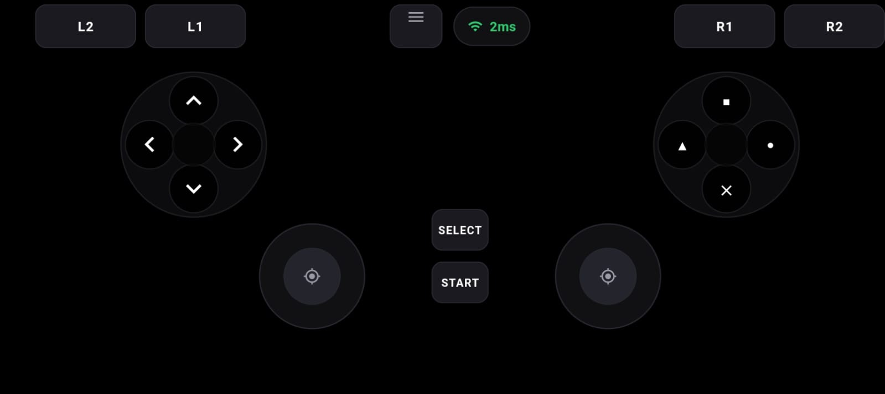
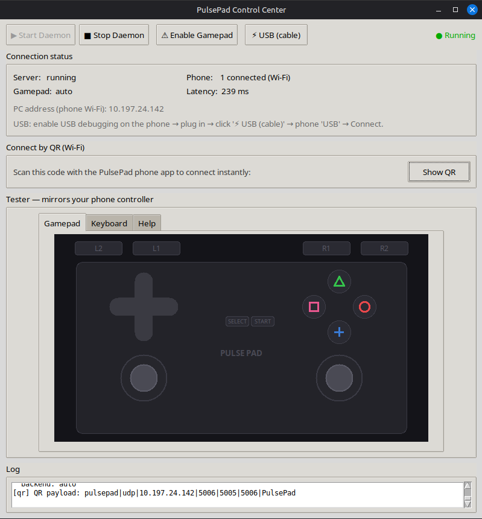

# PulsePad

Turn an Android phone into a game controller for a PC. Uses a binary wire
protocol over Wi-Fi (UDP) or USB (TCP via adb reverse) to feed a virtual
gamepad into Linux uinput or Windows ViGEmBus. Targets PS2 (PCSX2), PSP
(PPSSPP), Steam, and anything that takes a standard gamepad.

No accounts, no cloud. Windows / Linux / macOS (virtual gamepad is
network-only on macOS).

## Screenshots

| Android phone app | PulsePad Control Center (Linux) |
|---|---|
|  |  |

The left shot is the phone controller (PlayStation-style pad). The right shot
is the desktop Control Center with the gamepad/keyboard tester and USB walk
through.

## Features

- **Drop-in controller for any game or emulator.** PulsePad presents a
  standard virtual gamepad, so PCSX2, PPSSPP, Steam, RetroArch, and anything
  that takes a normal controller work directly - no per-game setup, no
  remapping in the emulator required.
- **True gamepad emulation, not keystrokes.** The virtual controller is a
  real gamepad input device; it never presses keyboard keys, grabs focus, or
  types into fields, so it can't conflict with your physical keyboard while
  playing or typing.
- **Works in browser controller test sites.** Because it registers as a
  standard Gamepad (Gamepad API / gamepad.js), sites like gamepad-tester /
  html5gamepad detect it as a real pad and show every button and stick.
- Binary full-state snapshots, coalesced 250 Hz sampling (USB ~1-5 ms,
  Wi-Fi ~5-15 ms).
- Playstation-style pad: D-pad, L1/R1/L2/R2 (analog + digital), L3/R3,
  SELECT/START, dual analog sticks.
- Wi-Fi auto-discovery, QR scan to fill IP + ports, or USB via `adb reverse`.
- Desktop Control Center: start/stop the daemon, live status and latency,
  QR display, and a gamepad + keyboard tester that lights up on input. On
  first run it prompts once (pkexec/sudo) to install the input rules.
- Auto-reconnect with PING/PONG latency readout.
- Haptic feedback and a button-press click (toggle in phone Settings).
- Controller layout: default Playstation-style pad, or a custom one built in
  the visual editor (gamepad buttons, keyboard keys, mouse actions).
- Small installs: a single-file Linux binary (with a broken-down `PulsePad-phone-*.apk`
  per device architecture at roughly 10-12 MB) - no store, no Google account.
- Headless CLI daemon (`pulsedad.py`) for servers and auto-start setups.
- Open source, offline, ad-free.
- Tests: 38 daemon unit tests (real sockets) + Flutter analyze clean and
  widget tests green.

## How it works

```
Phone app     -- TCP:5005 (USB, adb reverse) -->  PC daemon
  (Flutter)   -- UDP:5006 (Wi-Fi)            -->  uinput / ViGEmBus
              -- UDP:54321 (auto-discovery)  -->   virtual gamepad
```

Every GAMEPAD packet is a full snapshot, so a dropped packet never corrupts
state; the next packet is already complete.

## Project layout

```
phone/                            Flutter (Dart) -- the Android controller app
  lib/services/protocol.dart          byte-compatible binary protocol
  lib/services/connection_manager.dart  UDP/TCP, discovery, reconnect, latency
  lib/screens/controller_screen.dart    controller + custom-layout rendering
  lib/screens/connection_screen.dart    connect + auto-discover UI
  lib/screens/qr_scanner_screen.dart    scan the PC's QR code

pc/                               Python 3 daemon -- creates the virtual gamepad
  pulsepad_gui.py                     Control Center desktop GUI (Tkinter)
  pulsedad.py                         headless CLI daemon
  pulsepad/protocol.py                binary protocol
  pulsepad/server.py                  TCP/UDP/discovery server + haptics
  pulsepad/virtual_device.py          virtual gamepad backends (uinput / ViGEm)
  pulsepad/qr_config.py               QR connection payload format
  tests/                              38 unit tests (real loopback sockets)
  packaging/                          PyInstaller spec + per-OS build scripts
```

## Releases

Downloads live on the [GitHub Releases](https://github.com/Prince000101/PlusePad/releases) page.  Which file you need:

| File | What it is |
|------|------------|
| `PulsePad-2.1.1-linux-x86_64.tar.gz` | The PC Control Center app (daemon + GUI) for 64-bit Linux.  Extract it and run `PulsePad`. |
| `PulsePad-phone-arm64-v8a.apk` | The Android app for most modern phones.  Use this unless you know your CPU. |
| `PulsePad-phone-armeabi-v7a.apk` | The Android app for old 32-bit phones. |
| `PulsePad-phone-x86_64.apk` | The Android app for emulators / tablets on Intel/AMD CPU. |

`SHA256SUMS` (Linux) and `PulsePad-phone-SHA256SUMS` (Android) verify the
downloads.  The APK still needs USB debugging enabled on the phone for the
USB cable connection.

## PC setup

### Option A: desktop GUI

```bash
cd pc
pip install -r requirements.txt

python3 pulsepad_gui.py      # Linux / macOS
python  pulsepad_gui.py      # Windows
```

The Control Center starts/stops the daemon, shows the PC address and live
status, can display a QR code, and has a Gamepad / Keyboard tester. On the
first run on Linux it prompts once (pkexec/sudo) to install a udev rule so
any app can read the virtual controller.

### Option B: headless CLI

```bash
cd pc
sudo python3 pulsedad.py                                 # Linux, virtual pad
python pulsedad.py --backend=windows                     # Windows (ViGEmBus)
python pulsedad.py --no-virtual-device                   # server only, no sudo
```

Test the whole path without a phone:

```bash
cd pc && python3 simulate_phone.py --host 127.0.0.1
```

### Option C: package a standalone app

One command per OS produces a single portable binary:

```bash
cd pc && cmd /c packaging/build_windows.bat      # Windows -> dist/PulsePad.exe
cd pc && ./packaging/build_mac.sh                # macOS   -> dist/PulsePad.app
cd pc && ./packaging/build_linux.sh              # Linux   -> dist/PulsePad
```

See `packaging/README.md`.

## Build & install the phone app

```bash
cd phone
flutter pub get
flutter build apk --release --split-per-abi
# Per-ABI APKs: build/app/outputs/flutter-apk/app-{arm64-v8a,armeabi-v7a,x86_64}-release.apk
adb install build/app/outputs/flutter-apk/app-arm64-v8a-release.apk
```

Or `flutter run` with a device connected.

## Connect the phone

Wi-Fi:
1. Phone and PC on the same network.
2. Tap **Connect** in the app; it auto-discovers the PC (or type the IP shown
   in the Control Center).

Wi-Fi via QR:
1. In the Control Center click **Show QR**.
2. On the phone tap **Scan QR** and point it at the PC screen; IP, ports and
   mode are filled automatically, then tap **Connect**.

USB:
```bash
adb reverse tcp:5005 tcp:5005
```
Then in the app: **Connect**, pick USB. Requires USB debugging on the phone.

Pick a layout on the phone -- the default Playstation-style pad, or a custom
layout from the visual editor -- and play.

## Emulators and the virtual controller (Linux)

The daemon exposes two virtual devices:

| Device | What it does |
|--------|--------------|
| `PulsePad Gamepad` | the controller - D-pad, sticks, analog + digital triggers, all face/shoulder buttons. Games and emulators register this one. |
| `PulsePad Keyboard` | keyboard keys (WASD / arrows / SPACE / ...) injected as real keystrokes for games that only take a keyboard. |

Emulators read the gamepad via SDL2 from `/dev/input/event*`. For them to see
it, the udev rules must be installed (done automatically on the GUI's first
run, or with `sudo scripts/setup_linux_input.sh`) and the daemon must be
running (`▶ Start Daemon`).

## Controller mapping

| Input | uinput code |
|-------|-------------|
| A / B / X / Y | BTN_A / BTN_B / BTN_X / BTN_Y |
| L1 / R1 | BTN_TL / BTN_TR |
| L2 / R2 | ABS_Z / ABS_RZ (analog 0-255) + BTN_TL2 / BTN_TR2 (digital) |
| SELECT / START | BTN_SELECT / BTN_START |
| L3 / R3 | BTN_THUMBL / BTN_THUMBR |
| D-pad | ABS_HAT0X / ABS_HAT0Y |
| Sticks | ABS_X / ABS_Y / ABS_RX / ABS_RY (-32768..32767) |

## Protocol

Each packet starts with a header byte: `PROTOCOL_VERSION(4) | TYPE(4)`.
Multi-byte numbers are little-endian.

| Type | Byte | Size | Payload |
|------|-----:|-----:|---------|
| GAMEPAD | 1 | 13 | btns_lo, btns_hi, LX, LY, RX, RY (i16), L2, R2 (u8) |
| PING | 2 | 11 | timestamp ms (i64), seq (u16) |
| PONG | 3 | 11 | echoes the PING token |
| HAPTIC | 4 | 4 | duration / intensity / motor |
| HELLO | 5 | 1 | discovery request; the beacon reply offers ports |
| MOUSE | 6 | 6 | relative dx, dy (i16), buttons (u8) |
| KEY | 7 | 3 | keycode (u8), pressed (u8) |

## Running the tests

```bash
# pc -- 38 tests, real sockets, no root needed
cd pc && python3 -m unittest discover -s tests

# phone
cd phone && flutter analyze && flutter test
```

## Platform support

| Platform | Virtual gamepad | Notes |
|----------|-----------------|-------|
| Linux | uinput | needs `/dev/uinput` (sudo) |
| Windows | ViGEmBus | install bus + `pip install vigem-client` |
| macOS | none (network only) | daemon runs; virtual pad not implemented |
| Headless | none (null) | server / discovery still work |

## License

MIT